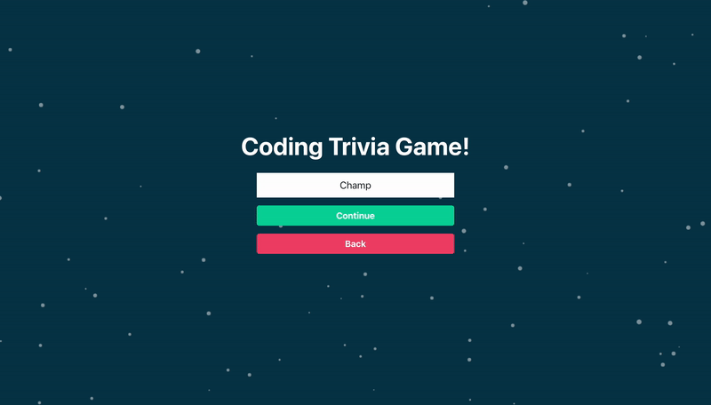
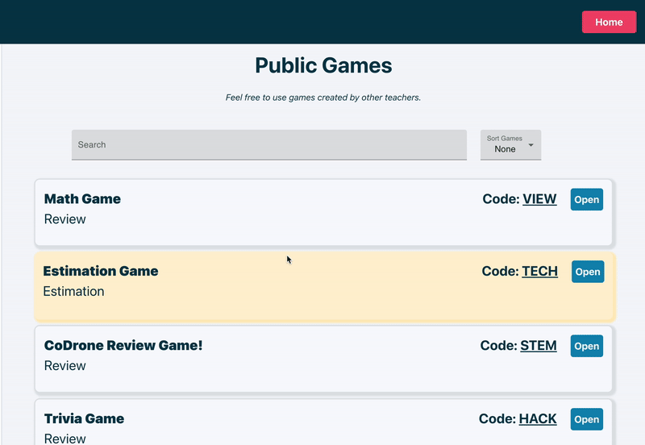
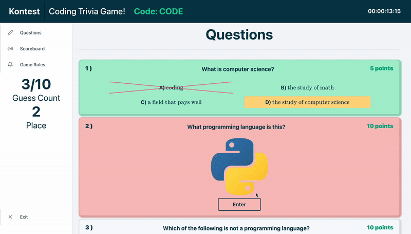

<h1 align="center">
  <br/>
  Kontest.us
  </br>
</h1>


<p align="center">
  <a href="#background">Background</a> •
  <a href="#usage">Usage</a> •
  <a href="#technologies">Technologies</a> •
  <a href="#license">License</a>
</p>

## Background
Kontest.us is an online, contest-hosting platform that MAXIMIZES student collaboration and freedom while MINIMIZING teacher work! Our platform supports two types of collaborative learning games: review games and estimation (similar to an Estimathon) games. This repository contains the frontend and API for our platform. Kontest.us was worked on from January 2021 - August 2021 by [Ashay Parikh](https://ashayp.com/) and [Labdhi Jain](https://www.linkedin.com/in/labdhi-jain). It was made open-source in August 2022, and is open for anyone to use or develop!

### Screenshots

<p align="center">
  
  <br>
  Students can join a game
</p>

<p align="center">
  
  <br>
  Teachers can create games
</p>


<p align="center">
  
  <br>
  Students can play review games
</p>


<p align="center">
  
  <br>
  Math students can play Estimathons/estimation games
</p>


## Usage

For local development, please clone this repository:
```
git clone https://github.com/Kontest-us/kontest.git
```

Then, follow the steps in [API: Getting Started](https://github.com/Kontest-us/kontest/blob/master/api/README.md) and [Client: Getting Started](https://github.com/Kontest-us/kontest/blob/master/client/README.md).

## Technologies

Written in [JavaScript](https://www.javascript.com/) and built with [React](https://reactjs.org/), [Socket.io](https://socket.io/), [Express](https://expressjs.com/), and [Firebase](https://firebase.google.com/). Uses [Prettier](https://prettier.io/).

## License
[GPLv3](https://github.com/Kontest-us/kontest/blob/master/LICENSE.MD) licensed
